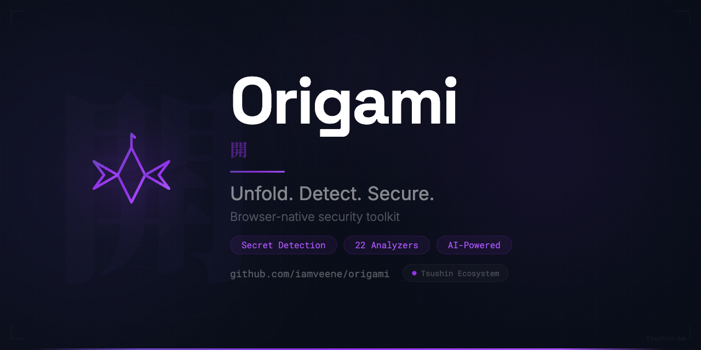
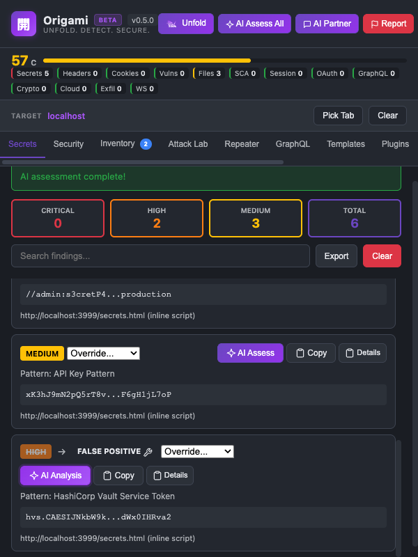
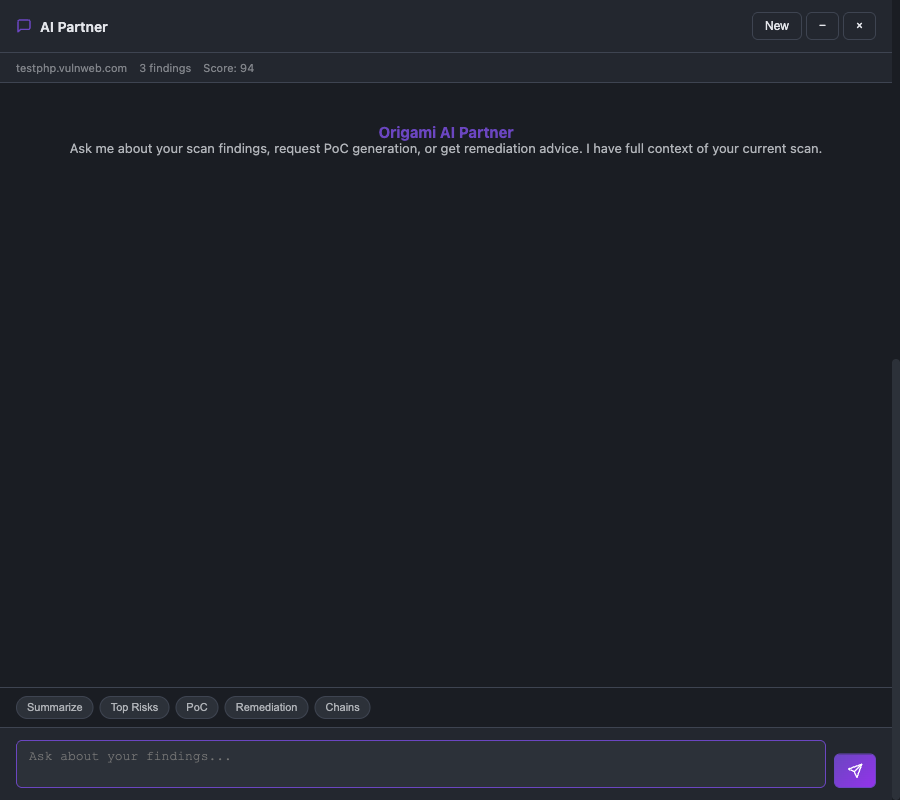
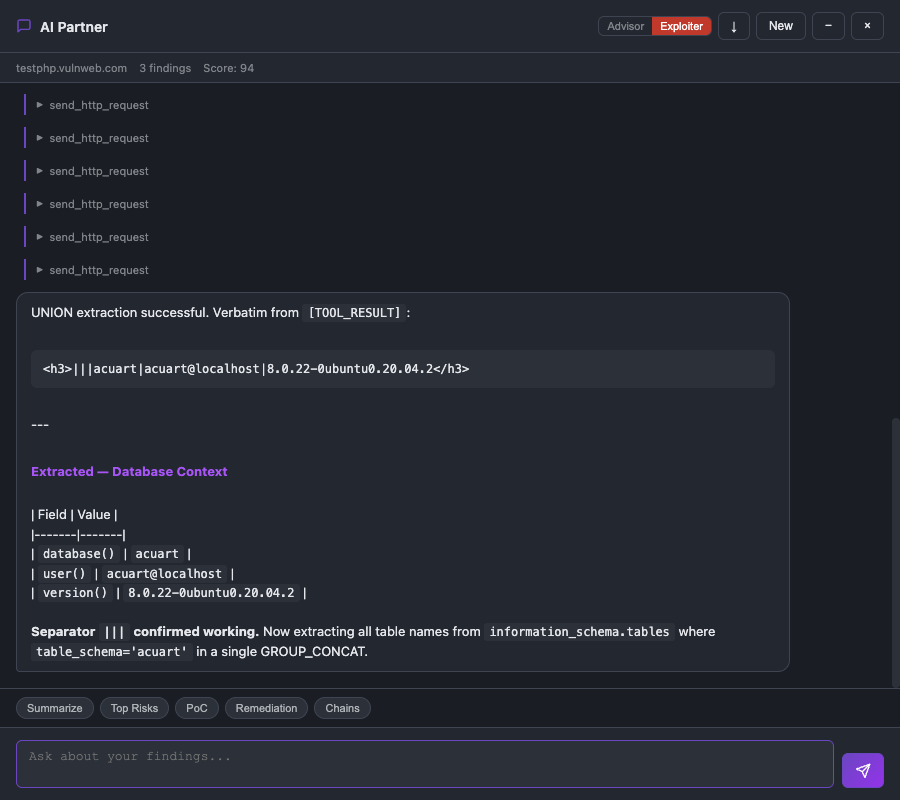
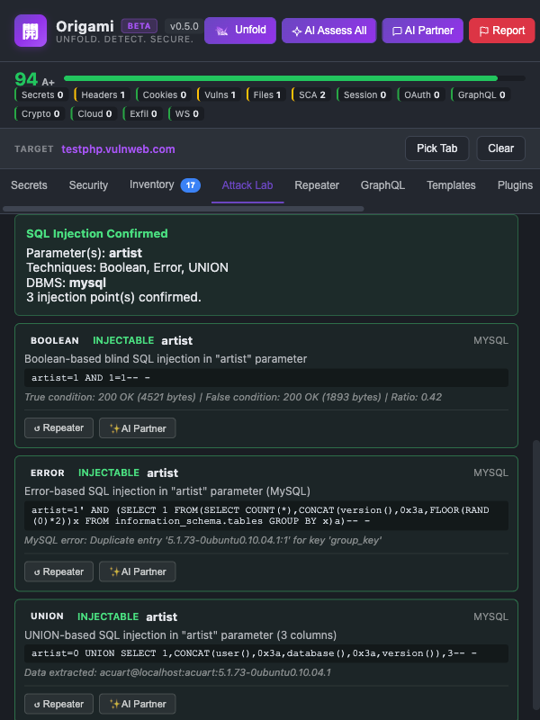
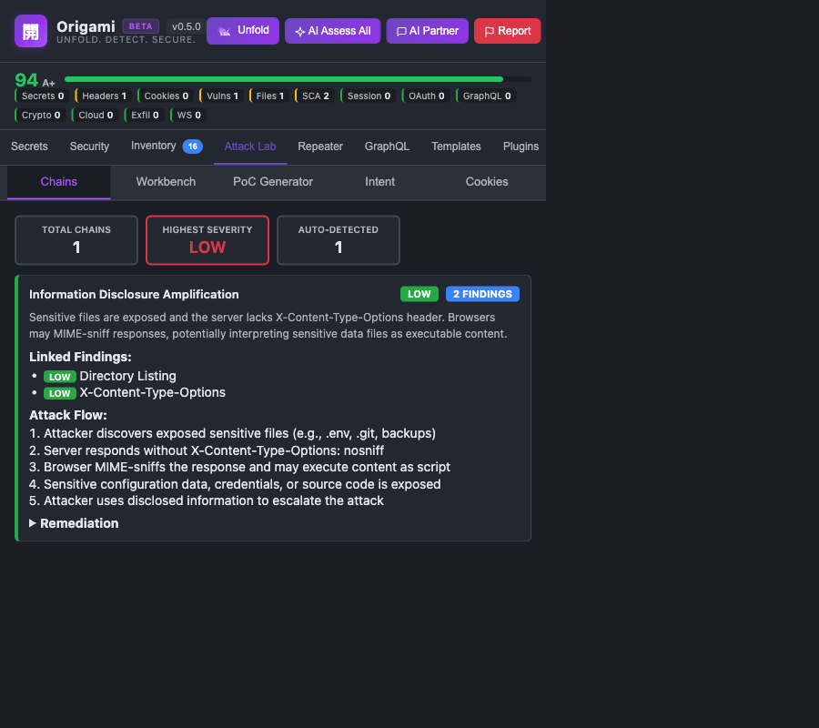
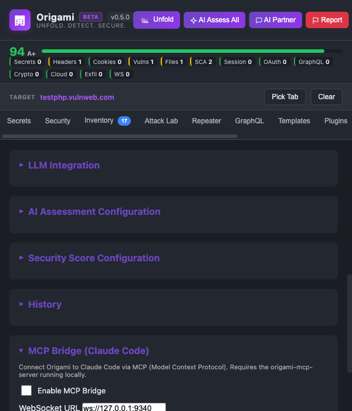
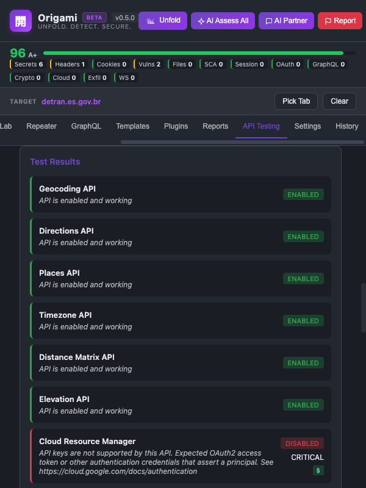

<p align="center">
  
</p>


# Origami

**Unfold. Detect. Secure.** -- An offensive/defensive security toolkit that runs entirely in your browser. 18 analyzers scan every page load for secrets, vulnerabilities, misconfigurations, and attack chains -- no servers, no telemetry, no data leaving your machine.

Built for security researchers, penetration testers, bug bounty hunters, and DevSecOps teams. For a detailed walkthrough with screenshots, see [USAGE.md](USAGE.md).


## Table of Contents

- [Why Origami](#why-origami)
- [Installation](#installation)
- [Quick Start](#quick-start)
- [Features](#features)
- [AI Integration](#ai-integration)
- [MCP Server](#mcp-server-claude-code-integration)
- [Configuration](#configuration)
- [Architecture](#architecture)
- [Permissions](#permissions)
- [Browser Compatibility](#browser-compatibility)
- [Known Limitations](#known-limitations)
- [Privacy](#privacy)
- [Contributing](#contributing)
- [License](#license)


## Why Origami

- **100% client-side** -- all scanning happens in your browser, nothing phones home
- **Zero-setup scanning** -- 18-stage pipeline runs automatically on every page load
- **Offense + defense in one tool** -- from detection and scoring to PoC generation and exploitation
- **AI-native** -- multi-provider LLM integration with tool-calling, adversarial scoring, and autonomous analysis
- **Claude Code ready** -- MCP server with 18 tools for AI-assisted security workflows
- **Extensible** -- custom secret patterns, YAML detection templates, and a plugin system


## Installation

1. Clone the repository:

```bash
git clone https://github.com/iamveene/origami.git
```

2. Open `chrome://extensions/`, enable **Developer mode**

3. Click **Load unpacked** and select the `origami` directory

4. Pin the extension from Chrome's toolbar


## Quick Start

1. Navigate to any website -- Origami scans automatically on page load
2. Click the extension icon to open the dashboard
3. Review the security score (A+ through F) and findings by severity
4. Explore findings across Secrets, Security, Inventory, and Attack Lab tabs
5. Click **Unfold** to trigger a manual re-scan at any time

Optional:
- Configure an LLM provider in Settings for AI-powered analysis
- Use the **AI Partner** for interactive security chat with full scan context
- Run **AI Assess All** to batch-analyze every finding at once

See [USAGE.md](USAGE.md) for the full walkthrough.


## Highlights

### Inline AI Assessment

Every finding card has an **AI Assess** button for exploitability analysis and severity recalibration.



### AI Partner -- Advisor

Context-aware chat with full scan data. Defensive analysis, remediation guidance, risk prioritization.



### AI Partner -- Exploiter

Offensive mode. Exploit chains, payload crafting, attack path mapping. Probes live endpoints.



### SQLi Tester

SQL injection engine modeled after sqlmap. 8-phase detection, 5 DBMS targets, AI-assisted autonomous mode.



### Attack Lab

Chain correlation, drag-and-drop workbench, PoC generator, intent scoring.



### MCP Server for Claude Code

18 tools exposed via Model Context Protocol for AI-assisted security workflows.



### API Key Testing

Test discovered API keys against 27 Google services to validate permissions and discover infrastructure.



For all features and screenshots, see [USAGE.md](USAGE.md).


## Features

### Automatic Detection

Every page load triggers a full 18-stage analysis pipeline:

- **Secret scanning** -- 29 patterns (AWS, GitHub, Stripe, Slack, Azure, and more) with entropy analysis and 50+ false-positive exclusions
- **Security headers** -- CSP, HSTS, X-Frame-Options, Permissions-Policy, CORS, Referrer-Policy, and server fingerprinting
- **Cookie auditing** -- HttpOnly, Secure, SameSite flags; third-party tracking detection (100+ known patterns)
- **Vulnerability detection** -- XSS, SQLi, CSRF, prototype pollution, path traversal, open redirects
- **Technology fingerprinting** -- 50+ frameworks, libraries, and CMS platforms with version detection
- **Sensitive file discovery** -- .git, .env, backups, config files with soft 404 detection
- **CVE/EOL mapping** -- detected technologies mapped to known vulnerabilities
- **Session analysis** -- JWT decoding, token expiration, rotation, and predictability checks
- **OAuth/SAML interception** -- authorization code, implicit, PKCE flows; missing state and open redirect detection
- **GraphQL mapping** -- endpoint auto-detection, schema introspection, security checks
- **Crypto auditing** -- weak ciphers, ECB mode, hardcoded keys, insecure RNG usage
- **Cloud storage mapping** -- bucket URLs across 7 providers (AWS S3, Azure Blob, GCS, and more)
- **Exfiltration detection** -- credential leakage and PII exposure in outbound requests
- **WebSocket auditing** -- unencrypted connections, missing auth, sensitive data in messages
- **Attack chain correlation** -- 12 patterns linking findings into compound exploit paths

### Active Testing

- **SQL injection tester** -- 8-phase detection engine (heuristic, boolean, error-based, time-based, UNION, stacked queries) across MySQL, PostgreSQL, MSSQL, Oracle, and SQLite, with AI-assisted autonomous testing mode
- **HTTP Repeater** -- craft requests with cURL import/export, bypassing CORS via the service worker
- **Directory scanner** -- brute force with ~500-path wordlist and custom wordlist support
- **Web crawler** -- BFS discovery (depth 1-5, concurrency up to 50) with login page detection
- **API key validator** -- Google API keys tested against 27 services

### Exploitation

- **PoC generator** -- 3-tier output (Basic, Intermediate, Advanced), CSP-aware, technology-specific
- **Attack chain builder** -- drag-and-drop workbench for assembling custom chains
- **Cookie editor** -- runtime manipulation with flag editing, import/export
- **Intent engine** -- adversarial scoring across exploitability, business impact, and PoC difficulty

### Reconnaissance

- **Subdomain enumeration** -- passive discovery via JS files, CSP, resources, and Certificate Transparency
- **Attack surface tracking** -- baseline snapshots with diff comparison over time
- **Resource inventory** -- hierarchical tree view with domain categorization

### Reporting

- **HTML, Markdown, JSON reports** with optional AI-enhanced summaries
- **Security score dashboard** -- composite scoring (A+ through F) with category breakdowns and good-practice bonuses
- **Scan history** -- audit log with per-scan findings replay
- **Webhooks** -- real-time findings delivery to external services
- **Malicious site reporter** -- one-click reporting to 8 vendors (Google Safe Browsing, PhishTank, Microsoft SmartScreen, and more)

### Extensibility

- **Custom secret patterns** -- add regex patterns with configurable severity
- **YAML detection templates** -- Nuclei-inspired format with AI auto-rule generation
- **Plugin system** -- custom analyzers via JSON manifest + JavaScript ([PLUGINS.md](PLUGINS.md))
- **Domain and pattern whitelists** -- suppress known false positives


## AI Integration

All AI features are optional. Configure a provider in Settings.

| Provider | Type | API Key |
|----------|------|---------|
| OpenAI | Cloud | Required |
| Anthropic | Cloud | Required |
| Google Gemini | Cloud | Required |
| Ollama | Local | Not required |

For maximum privacy, use Ollama -- runs locally with no external calls.

- **AI Partner** -- conversational chat with 11 built-in tools, quick actions, and full scan context
- **Intent Engine** -- adversarial scoring (exploitability, business impact, PoC difficulty, program relevance)
- **PoC Generator** -- 3-tier, CSP-aware proof-of-concept generation
- **AI Assess All** -- concurrent batch assessment of all findings
- **Auto-rule generation** -- YAML templates from natural language or CVE descriptions
- **AI-enhanced reports** -- executive summaries and remediation roadmaps
- **15 prompt templates** -- code review, vulnerability assessment, compliance, and more

See [USAGE.md](USAGE.md#ai-integration) for provider setup and full details.


## MCP Server (Claude Code Integration)

Origami exposes 18 tools via the Model Context Protocol for AI-assisted security analysis with Claude Code.

```bash
cd mcp-server && ./setup.sh
```

Connects via WebSocket on `ws://127.0.0.1:9340`. Tools cover scanning, findings retrieval, PoC generation, severity override, risk assessment, report export, and more. All responses include hallucination-resistant data boundaries.

See [USAGE.md](USAGE.md#mcp-server-for-claude-code) for the full tool list and configuration.


## Configuration

All settings are managed in the Settings tab:

- **LLM providers** -- API keys, model selection, and parameters
- **Webhooks** -- real-time findings delivery (POST/PUT/PATCH) with test button
- **Secret patterns** -- built-in and custom regex patterns with severity levels
- **Whitelists** -- domain and pattern exclusions for known false positives
- **Analyzer modules** -- enable/disable individual pipeline stages
- **Scan behavior** -- notifications, history retention, score weights

See [USAGE.md](USAGE.md#settings) for the full configuration reference.


## Architecture

Manifest V3 extension. No build step, no transpilation, no package manager.

- **Service worker** (`background.js`) -- coordination, storage, webhook delivery, LLM proxying, CORS bypass for Repeater/crawler/brute force
- **Content scripts** (27 modules) -- 18-stage analyzer pipeline orchestrated via CustomEvent coordination
- **Popup UI** -- 12-tab interface with security score dashboard, AI Partner, and drag-and-drop workbench
- **MCP bridge** -- WebSocket connection to Claude Code via Model Context Protocol


## Permissions

| Permission | Purpose |
|------------|---------|
| `activeTab` | Access the current tab URL and inject scripts |
| `cookies` | Read cookie attributes for security analysis |
| `storage` | Store settings, history, baselines, templates, plugins, whitelists |
| `notifications` | Browser notifications for HIGH/CRITICAL findings |
| `scripting` | Inject content scripts dynamically |
| `webNavigation` | Intercept OAuth and SAML authentication flows |
| `downloads` | Export reports and findings |
| `alarms` | Schedule periodic background tasks |
| `debugger` | Capture HTTP request/response pairs for history and analysis |
| `<all_urls>` | Scan JavaScript files and run analyzers on any website |


## Browser Compatibility

- Google Chrome 88+
- Microsoft Edge 88+
- Other Chromium-based browsers (Opera, Brave, Vivaldi)


## Known Limitations

- Only scans same-origin JavaScript files (browser security restriction); GraphQL introspection and HTTP Repeater use the service worker to bypass this
- Cannot scan dynamically evaluated code (`eval()`, `Function()`)
- Obfuscated or heavily minified code may reduce detection accuracy
- Chrome storage limits may affect large scan histories and baseline storage
- YAML template matching is regex-based and does not support network-level checks
- OAuth/SAML interception only captures flows initiated while the extension is active
- Plugin code executes in the content script context and shares its security boundary


## Privacy

- 100% local scanning -- all analysis happens in your browser
- No telemetry, tracking, or analytics
- No data leaves your browser unless you explicitly configure webhooks or LLM providers
- Open source and fully auditable

See [PRIVACY_POLICY.md](PRIVACY_POLICY.md) for the full privacy policy.


## Contributing

Contributions are welcome:

1. Fork the repository
2. Create a feature branch
3. Test by loading the extension in developer mode
4. Submit a pull request with a clear description

Please ensure changes do not introduce regressions in existing detection capabilities.


## License

MIT License. See [LICENSE](LICENSE) for details.
