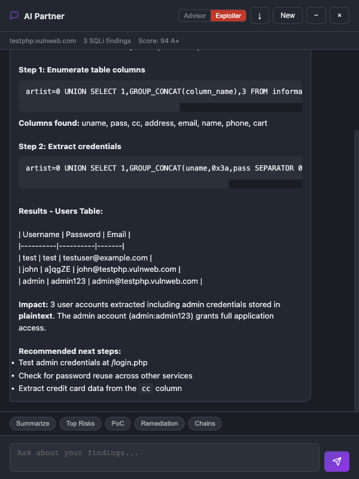
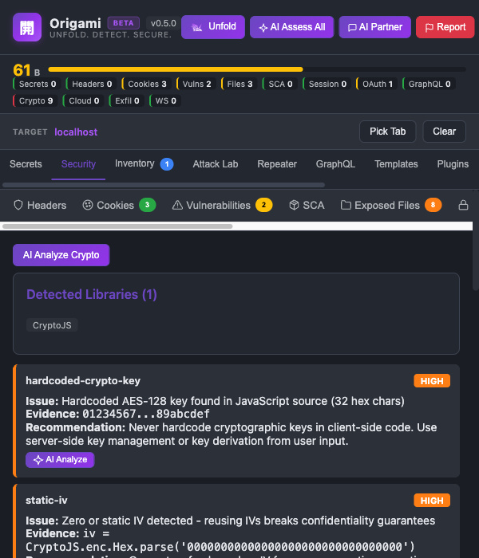
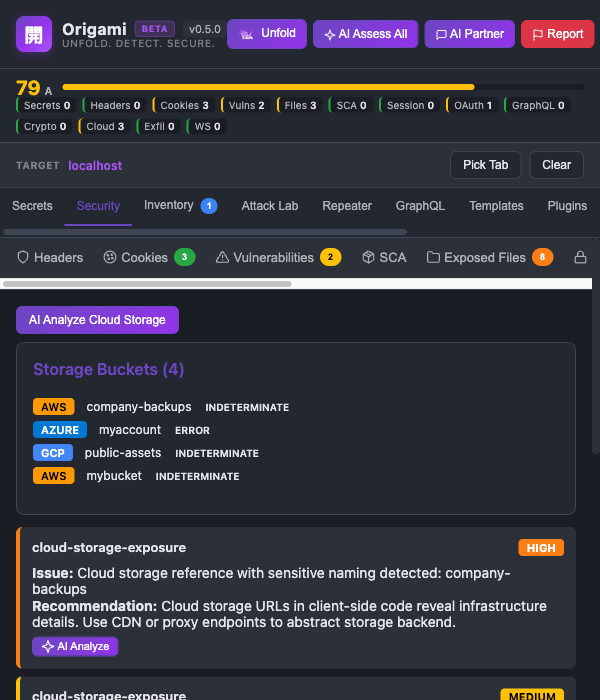
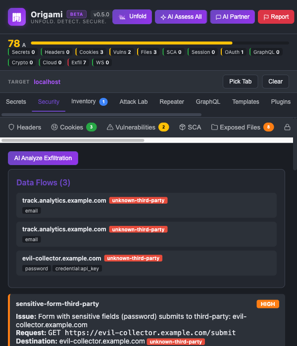
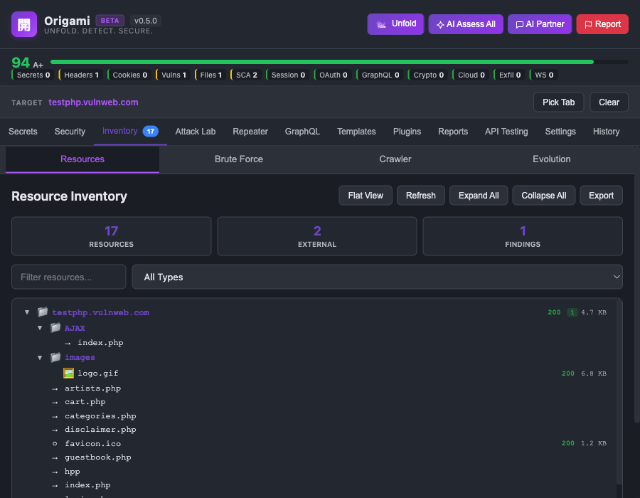
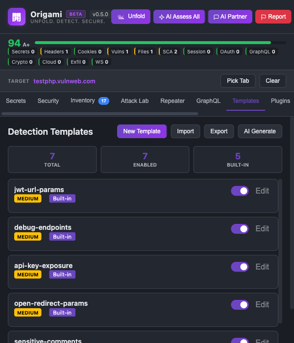

# Origami -- Usage Guide

Origami is a Chrome extension for offensive and defensive security testing that runs entirely in the browser.

## Table of Contents

1. [Installation](#installation)
2. [First Scan](#first-scan)
3. [AI Integration](#ai-integration)
4. [Attack Lab](#attack-lab)
5. [MCP Server for Claude Code](#mcp-server-for-claude-code)
6. [Secrets Detection](#secrets-detection)
7. [Security Analysis](#security-analysis)
8. [HTTP Repeater](#http-repeater)
9. [GraphQL Mapper](#graphql-mapper)
10. [Resource Inventory](#resource-inventory)
11. [API Key Testing](#api-key-testing)
12. [Detection Templates](#detection-templates)
13. [Plugins](#plugins)
14. [Reports](#reports)
15. [Scan History](#scan-history)
16. [Settings](#settings)


## Installation

### From Source (Developer Mode)

1. Clone or download the repository:

```bash
git clone https://github.com/iamveene/origami.git
```

2. Open Chrome and navigate to `chrome://extensions/`
3. Enable **Developer mode** (toggle in the top-right corner)
4. Click **Load unpacked** and select the `origami` directory
5. Pin the extension from Chrome's toolbar

## First Scan

Navigate to any website. Origami runs its 18-stage pipeline automatically on every page load. Click the extension icon to open the popup.

Header action buttons: **Unfold** (re-scan), **AI Assess All** (batch AI analysis), **AI Partner** (interactive chat), **Report** (flag malicious site).

### Security Score

Composite score (0--100) with letter grade. Starts at 100 with weighted deductions per finding severity (CRITICAL: 20, HIGH: 8, MEDIUM: 3, LOW: 1), diminishing returns, and exploitation-impact weights per category.

Bonus points (up to 26): strict CSP (+5), no secrets (+5), HSTS (+3), SRI (+3), X-Content-Type-Options (+2), Referrer-Policy (+2), Permissions-Policy (+2), cookies Secure (+2), cookies HttpOnly (+2).

**Grades**: A+ (90-100), A (78-89), B (60-77), C (40-59), D (20-39), F (0-19).


## AI Integration

Four LLM providers for security assessment. Optional, configured in [Settings](#settings).

| Provider | Models | API Key |
|----------|--------|---------|
| OpenAI | GPT-5.2, GPT-4o, GPT-4o Mini, GPT-4.1, GPT-4.1 Mini | Yes |
| Anthropic | Claude Opus 4.6, Claude Sonnet 4.6/4.5, Claude Haiku 4.5 | Yes |
| Google | Gemini 2.5 Flash, Flash Lite, Pro | Yes |
| Ollama | Gemma 3, Llama 3.1/3.2, Qwen 2.5, Phi-4, Mistral, DeepSeek | No (local) |

### Inline AI Assessment

Every finding card has an **AI Assess** button for exploitability analysis and severity recalibration.


### AI Assess All

Batch AI assessment across all findings at once.


### AI Partner -- Advisor

Context-aware chat with full scan data. Defensive analysis, remediation guidance, risk prioritization.


### AI Partner -- Exploiter

Offensive mode. Exploit chains, payload crafting, attack path mapping. Probes live endpoints.


Findings from other tools can be sent directly to AI Partner. Here the AI autonomously exploits a confirmed SQL injection, extracting the users table:




## Attack Lab

Tools for analyzing, chaining, and exploiting findings.


### Chains

Correlation engine linking findings into multi-step attack chains. 12 built-in patterns (XSS + missing CSP, token theft, CSRF + session hijack, OAuth redirect theft, etc.).


### Workbench

Drag-and-drop chain builder with AI analysis.


### PoC Generator

Three tiers: Basic (payload), Intermediate (bypass techniques), Advanced (full exploitation chain). CSP-aware, technology-specific.


### Intent

AI-powered risk scoring with exploitability and business impact dimensions.


### SQLi Tester

SQL injection engine modeled after sqlmap. 8-phase detection (heuristic, boolean, error, time, UNION, stacked), 5 DBMS targets, cURL import, AI-assisted autonomous mode. Confirmed findings hand off to Repeater and AI Partner.


## MCP Server for Claude Code

Model Context Protocol server exposing 18 scan tools to Claude Code via WebSocket bridge.


```bash
cd mcp-server && ./setup.sh
```

Tools: `scan_page`, `get_findings_summary`, `get_findings_by_category`, `get_finding_detail`, `get_security_score`, `get_technologies`, `check_cves`, `get_attack_chains`, `assess_risk`, `generate_poc`, `override_severity`, `send_request`, `get_session_analysis`, `get_auth_flows`, `get_graphql_schema`, `export_report`, `get_page_info`, `get_connection_status`


## Secrets Detection

Default landing tab. 29 built-in patterns across four severity levels.


- **CRITICAL** (5) -- AWS keys, Stripe live keys, private key headers, Azure connection strings, database URLs
- **HIGH** (11) -- GitHub/GitLab/Slack/SendGrid tokens, Google OAuth2/Cloud keys, Vault/Terraform/Databricks tokens
- **MEDIUM** (6) -- GCP service accounts, JWTs, generic API keys, CircleCI tokens, password assignments
- **LOW** (2) -- Firebase configs, Datadog APP keys

Custom patterns in Settings. Shannon entropy filtering suppresses false positives.


## Security Analysis

11 sub-tabs covering the full analysis pipeline.


### Pipeline Overview

| Stage | Analyzer | Description |
|-------|----------|-------------|
| 1 | Headers | CSP, HSTS, X-Frame-Options, Permissions-Policy, CORS, Referrer-Policy |
| 2 | Cookies | HttpOnly, Secure, SameSite flags; 100+ third-party tracking patterns |
| 3 | Vulnerabilities | XSS, SQLi, CSRF, prototype pollution, path traversal, open redirects |
| 4 | Technologies | 50+ frameworks/libraries with version detection |
| 5 | Sensitive files | .git, .env, backups, source maps with soft 404 detection |
| 6 | Resources | Scripts, stylesheets, images, fonts, iframes |
| 7 | Session | JWT decode, expiration, rotation, predictable session detection |
| 8 | OAuth/SAML | Auth code, implicit, PKCE flows; missing state, open redirects |
| 9 | GraphQL | Endpoint detection, introspection, security checks |
| 10 | Crypto | Weak ciphers, ECB mode, hardcoded keys, Math.random() misuse |
| 11 | Cloud storage | Bucket URLs across 7 providers, public access testing |
| 12 | Exfiltration | Credential leakage, PII exposure in outbound requests |
| 13 | WebSocket | Unencrypted ws://, missing auth, sensitive data in messages |
| 14 | JS obfuscation | Obfuscation scoring, minification filtering |
| 15 | Templates | Custom YAML detection rules |
| 16 | Surface tracking | Domain baseline snapshots |
| 17 | Correlation | Multi-step attack chains (12 patterns) |
| 18 | Plugins | Custom analyzer plugins |

### Headers


### Cookies


### Vulnerabilities


### SCA


### Exposed Files


### Session


### Auth Flows


### Crypto



### Cloud Storage



### Exfiltration



### WebSocket


## HTTP Repeater

HTTP request crafting with CORS bypass via service worker. All methods, custom headers, cURL import/export, request history.


## GraphQL Mapper

Auto-detect GraphQL endpoints, run introspection, visualize schema, and check for auth gaps, deep nesting DoS, and sensitive field exposure. Built-in query builder.


## Resource Inventory



### Resources

Tree and flat views of all page resources. External domains categorized (CDN, Analytics, Ads, Payment, etc.).

### Brute Force

Directory brute forcing with 500+ path wordlist. Custom wordlists, configurable concurrency.


### Crawler

Link discovery across the current domain.


## API Key Testing

Test discovered API keys against live services.


Google API keys are tested against 27 services. AWS and Azure support coming soon.


## Detection Templates

Nuclei-inspired YAML templates for custom detection rules. 5 built-in templates, regex matchers, AI Auto-Rule Generator.




## Plugins

Custom analyzer plugins via JSON manifests. See [PLUGINS.md](PLUGINS.md).


## Reports

HTML, Markdown, or JSON reports. AI-enhanced executive summaries. Webhook integration for CI/CD.


## Scan History

Up to 100 past scans with URL, severity counts, and score. Click to review.


## Settings


Notifications, webhook integration, domain whitelist, secret detection patterns, vulnerability scanning toggles, CVE/EOL checking, analyzer modules, LLM prompt templates, LLM provider configuration, AI assessment settings, security score weights, scan history retention, MCP bridge.
