# Origami -- Usage Guide

Origami is a Chrome extension for offensive and defensive security testing that runs entirely in the browser. This guide covers installation, first-time setup, and each major feature.

## Table of Contents

1. [Installation](#installation)
2. [First Scan](#first-scan)
3. [AI Integration](#ai-integration)
4. [Attack Lab](#attack-lab)
5. [MCP Server for Claude Code](#mcp-server-for-claude-code)
6. [Secrets Detection](#secrets-detection)
7. [Security Analysis](#security-analysis)
8. [HTTP Repeater](#http-repeater)
9. [GraphQL Mapper](#graphql-mapper)
10. [Resource Inventory](#resource-inventory)
11. [API Key Testing](#api-key-testing)
12. [Detection Templates](#detection-templates)
13. [Plugins](#plugins)
14. [Reports](#reports)
15. [Scan History](#scan-history)
16. [Settings](#settings)


## Installation

### From Source (Developer Mode)

1. Clone or download the repository:

```bash
git clone https://github.com/iamveene/origami.git
```

2. Open Chrome and navigate to `chrome://extensions/`

3. Enable **Developer mode** (toggle in the top-right corner)

4. Click **Load unpacked** and select the `origami` directory (the one containing `manifest.json`)

5. Pin the extension by clicking the puzzle icon in Chrome's toolbar and pinning Origami

## First Scan

After installing the extension, navigate to any website. Origami runs its 18-stage analyzer pipeline automatically on every page load. The extension icon shows a badge with the number of findings. Browser notifications appear for HIGH and CRITICAL risk findings.

Click the extension icon to open the popup. The header shows the Origami brand, version, and four action buttons:

- **Unfold** -- Trigger a manual re-scan of the current page. Useful after dynamic content loads or SPA navigation.
- **AI Assess All** -- Run AI assessment across all findings simultaneously (requires LLM configuration).
- **AI Partner** -- Open the AI chat interface for interactive security analysis.
- **Report** -- Report the current site as malicious to multiple security vendors.

After a scan completes, a security score dashboard appears at the top showing a composite score (0--100) with a letter grade and a breakdown of findings by category (Headers, Cookies, Vulns, Files, SCA, Session, OAuth, GraphQL, Crypto, Cloud, Exfil, WS).

### Security Score

The score starts at 100 and applies weighted deductions per category. Each finding severity has a point cost (CRITICAL: 20, HIGH: 8, MEDIUM: 3, LOW: 1) with diminishing returns for duplicate patterns within the same category. Per-category deductions are multiplied by exploitation-impact weights (secrets 1.5x, SCA 1.4x, vulnerabilities 1.2x down to cookies 0.2x) and capped to prevent any single noisy category from dominating the score.

Good security practices earn bonus points (up to 25 total): strict CSP (+5), no exposed secrets (+5), HSTS with includeSubDomains (+3), SRI on cross-origin scripts (+3), X-Content-Type-Options (+2), Referrer-Policy (+2), Permissions-Policy (+2), all cookies Secure (+2), all cookies HttpOnly (+2).

**Grades**: A+ (90-100), A (78-89), B (60-77), C (40-59), D (20-39), F (0-19).

**Categories**: Secrets, headers, cookies, vulnerabilities, sensitive files, SCA (CVE/EOL from detected technologies), session, OAuth, GraphQL, crypto, cloud storage, exfiltration, WebSocket.

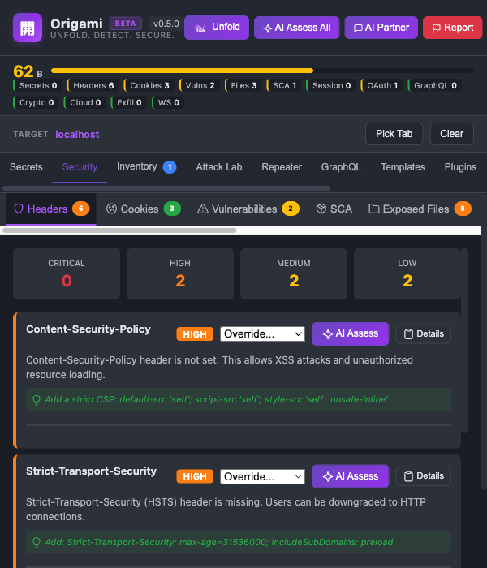


## AI Integration

Origami integrates with four LLM providers for intelligent security assessment. AI features are optional and require configuration in Settings.

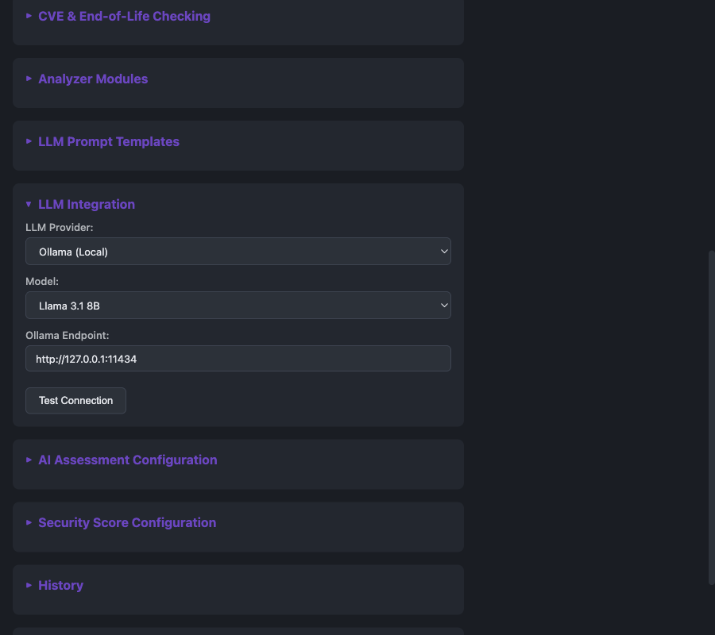

### Supported Providers

| Provider | Models | API Key Required |
|----------|--------|-----------------|
| OpenAI | GPT-5.2, GPT-4o, GPT-4o Mini, GPT-4.1, GPT-4.1 Mini, GPT-4 Turbo | Yes |
| Anthropic | Claude Sonnet 4.6, Claude Opus 4.6, Claude Sonnet 4.5, Claude Haiku 4.5 | Yes |
| Google | Gemini 2.5 Flash, Gemini 2.5 Flash Lite, Gemini 2.5 Pro | Yes |
| Ollama | Gemma 3, Llama 3.1/3.2, Qwen 2.5 Coder, Phi-4, Mistral, Code Llama, DeepSeek Coder | No (local) |

### Configuration

1. Go to **Settings** and expand the **LLM Integration** section
2. Select your provider
3. Enter your API key (not required for Ollama)
4. Choose a model and adjust parameters (temperature, max tokens)
5. Click **Test Connection** to verify

For maximum privacy, use **Ollama** with local models at `http://localhost:11434`. No API key or external calls required.

### Inline AI Assessment

Every finding card includes an **AI Assess** button. Click it to get a detailed analysis with exploitability rating, impact assessment, and a recommended severity level that auto-applies if different from the original.


### AI Assess All

Bulk-assess all findings at once. Click **AI Assess All** in the header to run batch analysis across all categories. Configurable concurrency and severity filters in Settings.

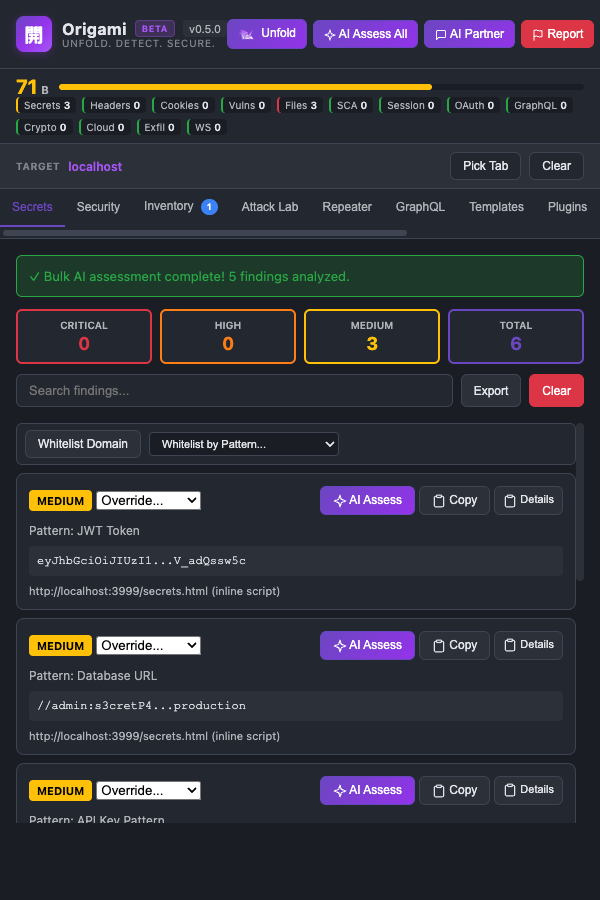

### AI Partner -- Advisor

Context-aware chat with full scan data. Advisor mode provides defensive analysis, remediation guidance, and risk prioritization. Quick-action buttons: Summarize, Top Risks, PoC, Remediation, Chains.


### AI Partner -- Exploiter

Switch to Exploiter mode for offensive analysis. Generates exploit chains, crafts payloads, and maps attack paths. Tool calls probe live endpoints for validation.


### PoC Generator

Context-aware proof-of-concept generation in Attack Lab. Select any finding and generate three tiers of exploits: Basic payload, Intermediate with bypass techniques, and Advanced with full exploitation chain. CSP-aware and technology-specific.

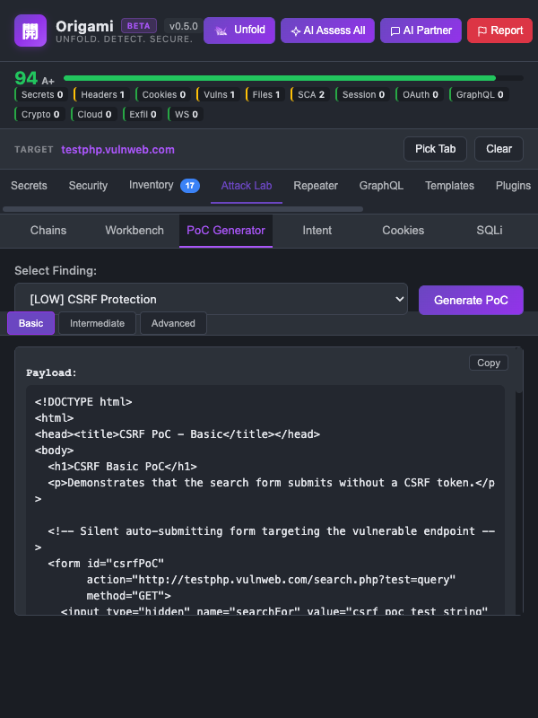

### Intent Engine

AI-powered risk scoring in Attack Lab > Intent. Evaluates all findings on four dimensions: exploitability, business impact, PoC difficulty, and program relevance. Composite scores prioritize the highest-value targets.

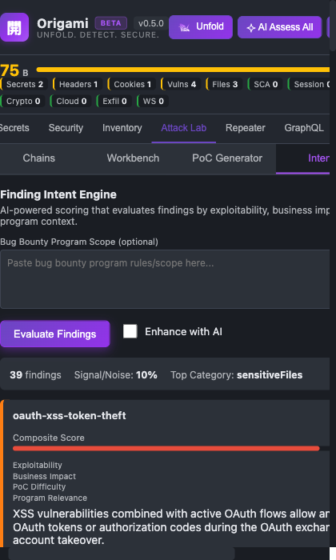

### Additional AI Capabilities

- **15 pre-built prompt templates** covering OWASP analysis, compliance, attack surface mapping
- **Custom prompts** for specialized analysis
- **Auto-rule generation** from natural language descriptions
- **Risk scoring** with CVSS-aligned exploitability and business impact
- **Streaming responses** for real-time output


## Attack Lab

The Attack Lab provides tools for analyzing, chaining, and exploiting findings. It contains six sub-tabs.


### Chains

The correlation engine links related findings across all analyzer outputs into multi-step attack chains. 12 built-in chain patterns detect compound vulnerabilities that individual scanners miss, including XSS + missing CSP, token theft via XSS, CSRF + session hijack, OAuth redirect token theft, and more.

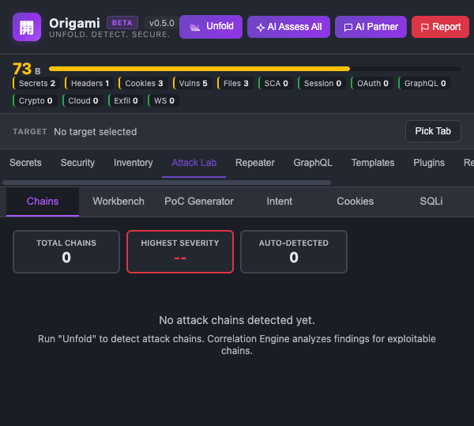

### Workbench

Interactive drag-and-drop chain builder for constructing custom attack chains from current page findings. Finding cards on the left, chain canvas in the center, AI analysis on the right.

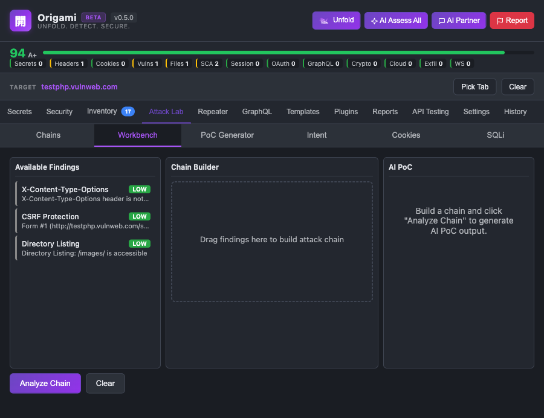

### PoC Generator

Context-aware proof-of-concept generation for individual findings and assembled attack chains. Requires LLM configuration.

- **Basic** -- PoC payload
- **Intermediate** -- Bypass techniques and defensive measures
- **Advanced** -- Full exploitation chain with post-exploitation scenarios
- CSP-aware payload generation that accounts for active Content Security Policies
- Technology-specific techniques tailored to the detected stack


### Intent

AI-powered intent analysis engine for assessing the risk posture of detected findings with exploitability and business impact scoring.


### Cookies

Cookie manipulation and analysis tools for testing cookie-based attack vectors.

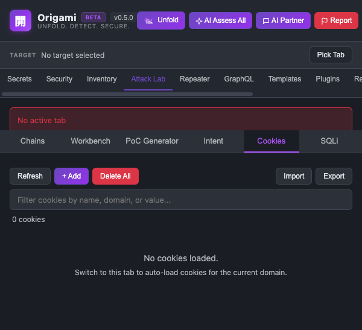

### SQLi Tester

Browser-based SQL injection testing engine modeled after sqlmap's detection methodology. Runs entirely through the service worker -- no external tools or proxies needed.

- **8-phase detection pipeline** -- heuristic probing, boolean-based blind (AND/OR, numeric and string variants), error-based (database-specific signatures), time-based blind, UNION column enumeration, and stacked queries
- **5 DBMS targets** -- MySQL, PostgreSQL, MSSQL, Oracle, SQLite with database-specific payloads and error signatures
- **Flexible input** -- enter a URL with query parameters, import a cURL command, or load a request from Repeater History
- **POST body support** -- test parameters in form data and JSON bodies alongside URL query parameters
- **Configurable risk and techniques** -- select which injection techniques to run (Boolean, Error, Time, UNION, Stacked) and risk level (1-3)
- **AI-assisted mode** -- enable the AI checkbox to let an LLM partner autonomously plan and execute injection strategies, interpret results, and escalate through detection phases with optional user guidance
- **Confirmed findings** -- confirmed vulnerabilities inject into the Security tab's vulnerability results with full evidence (payload, response snippet, detection method)
- **Action buttons** -- confirmed findings include direct handover to Repeater (pre-filled with the vulnerable request) and AI Partner (pre-loaded with injection context)


## MCP Server for Claude Code

Origami includes a Model Context Protocol server that exposes scan findings to Claude Code for AI-assisted security analysis. Configure the WebSocket bridge in Settings under **MCP Bridge (Claude Code)**.


### Setup

```bash
cd mcp-server
./setup.sh
```

This installs the MCP server and registers it with Claude Code.

### Available Tools (18 total)

`get_connection_status`, `scan_page`, `get_findings_summary`, `get_findings_by_category`, `get_finding_detail`, `get_security_score`, `get_technologies`, `check_cves`, `get_attack_chains`, `assess_risk`, `generate_poc`, `override_severity`, `send_request`, `get_session_analysis`, `get_auth_flows`, `get_graphql_schema`, `export_report`, `get_page_info`

All tool responses include hallucination-resistant data boundaries. The MCP server uses a WebSocket bridge (`ws://127.0.0.1:9340`) for real-time communication between the extension and Claude Code. The bridge token is configured in Settings.


## Secrets Detection

The Secrets tab is the default landing tab. It displays all detected secrets with severity levels, matched patterns, and source locations.

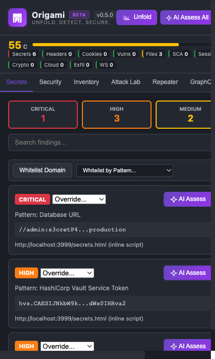

- **Severity cards** at the top show counts for Critical, High, Medium, and Total findings
- **Search** to filter findings by keyword
- **Export** findings as JSON for offline analysis
- **Clear** to remove all current findings

Origami detects 29 built-in secret patterns organized by severity:

**CRITICAL** -- Credentials enabling immediate account takeover, data breach, or financial loss:
- AWS Access Keys (`AKIA...`, `ASIA...`)
- Stripe Live Keys (`sk_live_...`)
- Private Key Headers (RSA, EC, DSA, OpenSSH)
- Azure Connection Strings
- Database URLs (MongoDB, MySQL, PostgreSQL, Redis, AMQP, MSSQL)

**HIGH** -- Credentials with specific prefix formats enabling direct service access:
- GitHub Tokens (`ghp_`, `gho_`, `ghu_`, `ghs_`, fine-grained PATs)
- Slack Tokens (`xoxb-`, `xoxa-`) and Webhooks
- SendGrid API Keys (`SG.`)
- GitLab Tokens (`glpat-`)
- Google OAuth2 (Refresh Tokens `1//`, Client Secrets `GOCSPX-`, Access Tokens `ya29.`)
- Google Cloud API Keys (`AIza...`)
- Client Secrets (UUID format)
- HashiCorp Vault Tokens (`hvs.`, `hvb.`)
- Terraform Cloud Tokens
- Databricks Tokens (`dapi...`)
- Datadog API Keys

**MEDIUM** -- Patterns requiring context validation:
- GCP Service Account Keys
- JWT Tokens
- Generic API Key / Access Token assignments
- CircleCI Tokens
- Password / Secret assignments in code
- Basic Auth in URLs

**LOW** -- Informational or context-dependent:
- Firebase Config blocks
- Datadog APP Keys

**Custom Patterns** -- Add your own regex patterns with configurable risk levels in Settings.

Smart filtering: 50+ test value exclusions (test-, example-, dummy-, placeholder-, etc.) and Shannon entropy analysis to suppress false positives from minified code.


## Security Analysis

The Security tab contains 11 sub-tabs covering the full security analysis pipeline. Click "Unfold" to populate results across all sub-tabs.

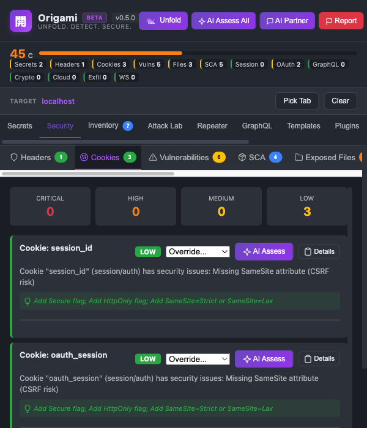

### Pipeline Overview

An 18-stage pipeline runs automatically on every page load. Secret scanning (`scanner.js`) runs independently and in parallel with the analyzer coordinator.

| Stage | Analyzer | Description |
|-------|----------|-------------|
| 1 | Header analysis | Validate CSP, HSTS, X-Frame-Options, X-Content-Type-Options, Permissions-Policy, CORS, Referrer-Policy, server fingerprinting |
| 2 | Cookie analysis | Audit HttpOnly, Secure, SameSite, expiration flags; classify third-party tracking cookies (100+ known patterns) |
| 3 | Vulnerability scanning | Detect XSS (DOM/reflected/stored), SQL injection, CSRF, prototype pollution, path traversal, open redirects |
| 4 | Technology fingerprinting | Identify 50+ frameworks, libraries, CMS platforms, CDNs, and build tools with version detection |
| 5 | Sensitive file discovery | Probe for exposed .git, .env, backup, debug, and configuration files with soft 404 detection |
| 6 | Resource collection | Collect scripts, stylesheets, images, fonts, iframes for the resource inventory |
| 7 | Session state analysis | Decode JWTs in cookies, localStorage, sessionStorage; check expiration, rotation, predictable session detection |
| 8 | OAuth/SAML interception | Capture authorization code, implicit, PKCE flows; decode SAML assertions; detect missing state, open redirects |
| 9 | GraphQL mapping | Auto-detect endpoints (Apollo, urql, Relay, raw `/graphql`); run introspection queries; security checks |
| 10 | Crypto auditing | Detect weak ciphers (DES, RC4), ECB mode, hardcoded keys/IVs, insecure `Math.random()` across 10+ libraries |
| 11 | Cloud storage mapping | Identify bucket URLs across 7 providers (AWS S3, Azure Blob, GCP, DigitalOcean, Backblaze B2, Wasabi, MinIO) |
| 12 | Exfiltration detection | Monitor outbound requests for credential leakage, PII exposure, and authentication endpoint patterns |
| 13 | WebSocket auditing | Detect unencrypted ws:// connections, missing auth, sensitive data in messages, SSE monitoring |
| 14 | JS obfuscation detection | Score obfuscation signals (0-5+), distinguish from legitimate minification, filter CDN/library patterns |
| 15 | YAML template matching | Run custom Nuclei-inspired detection templates against the current page |
| 16 | Surface tracking | Capture domain baseline snapshots for attack surface evolution comparison |
| 17 | Finding correlation | Link findings across all analyzers into multi-step attack chains (12 chain patterns) |
| 18 | Plugin execution | Run registered custom analyzer plugins |

### Headers

Validates 12+ security headers including CSP, HSTS, X-Frame-Options, X-Content-Type-Options, Permissions-Policy, and more. Each header is graded with specific remediation guidance.


### Cookies

Audits all cookies for HttpOnly, Secure, and SameSite flags. Detects third-party tracking cookies across 100+ known patterns and checks expiration policies.

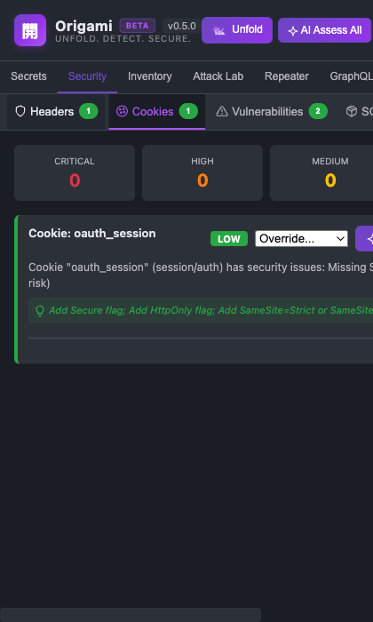

### Vulnerabilities

Detects XSS, SQL injection, CSRF, prototype pollution, path traversal, and open redirect patterns in the page source and DOM.

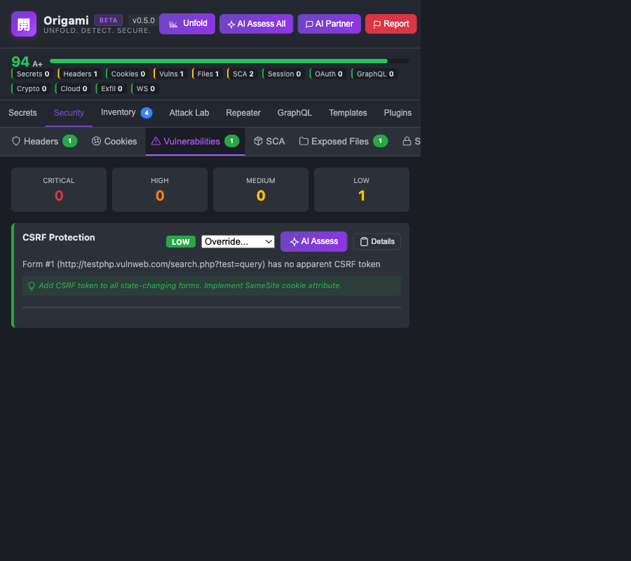

### SCA (Software Composition Analysis)

Identifies 50+ frameworks, libraries, CMS platforms, CDNs, and build tools with version detection. Maps detected technologies to known CVEs via OSV and end-of-life status via endoflife.date.

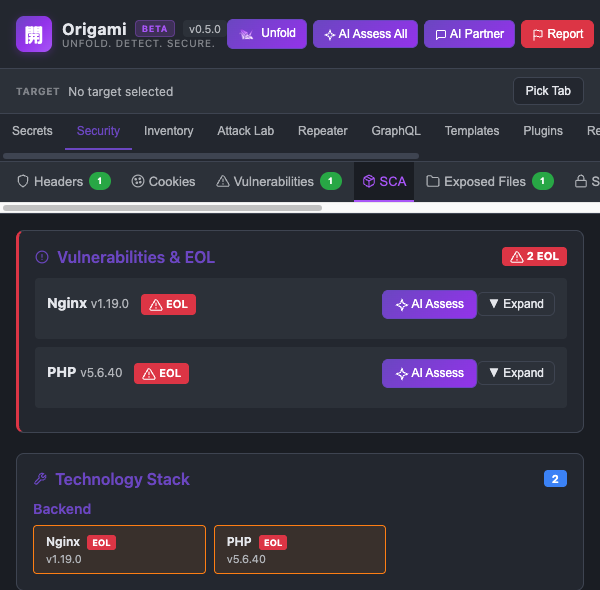

### Exposed Files

Probes for sensitive files including `.git`, `.env`, backups, source maps, and directory listings with soft 404 detection to avoid false positives.

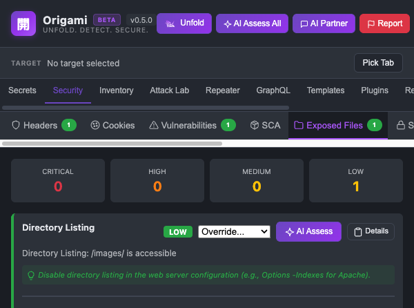

### Session

Decodes JWTs found in cookies, localStorage, and sessionStorage. Checks token expiration, rotation patterns, and refresh mechanisms.

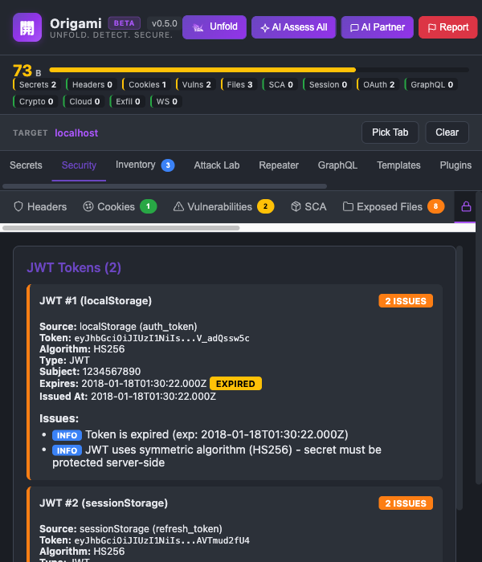

### Auth Flows

Captures OAuth and SAML authentication flows via the `webNavigation` API. Detects missing state parameters, low-entropy state values, missing PKCE, open redirect in redirect_uri, client secrets in URLs, and implicit flow token exposure. Decodes SAML assertions and validates signatures.

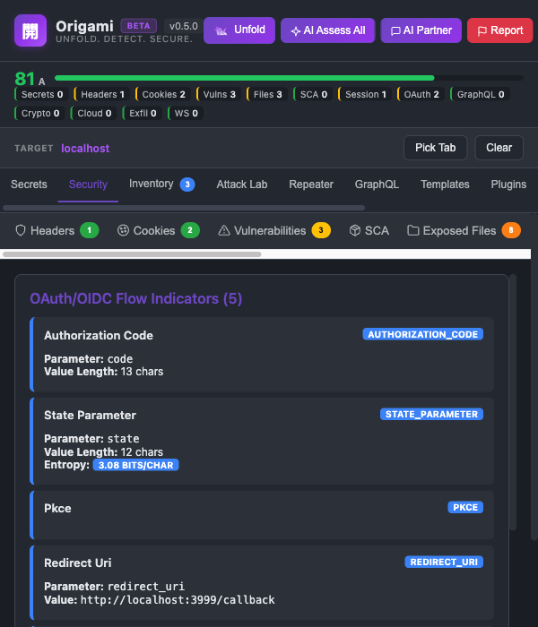

### Crypto

Detects cryptographic implementation weaknesses across 10+ libraries. Identifies hardcoded keys and IVs, weak cipher algorithms (DES, RC4), ECB mode, missing authentication, weak key derivation, and `Math.random()` misuse. Findings appear when the scanned page uses client-side cryptography libraries (CryptoJS, WebCrypto API, etc.).

### Cloud Storage

Maps cloud storage bucket URLs across 7 providers (AWS S3, Azure Blob, GCS, DigitalOcean Spaces, Backblaze B2, Wasabi, MinIO) and tests for public access misconfigurations. Findings appear when the scanned page references cloud storage bucket URLs.

### Exfiltration

Monitors outbound requests for credential leakage and PII exposure. Detects passwords, tokens, API keys, session identifiers, credit card numbers, SSNs, email addresses, and phone numbers in outgoing data. Findings appear when the scanned page sends requests containing credentials or PII.

### WebSocket

Audits WebSocket (ws/wss) and Server-Sent Events connections for unencrypted connections, missing authentication on upgrades, sensitive data transmission, and serialization attack risks.

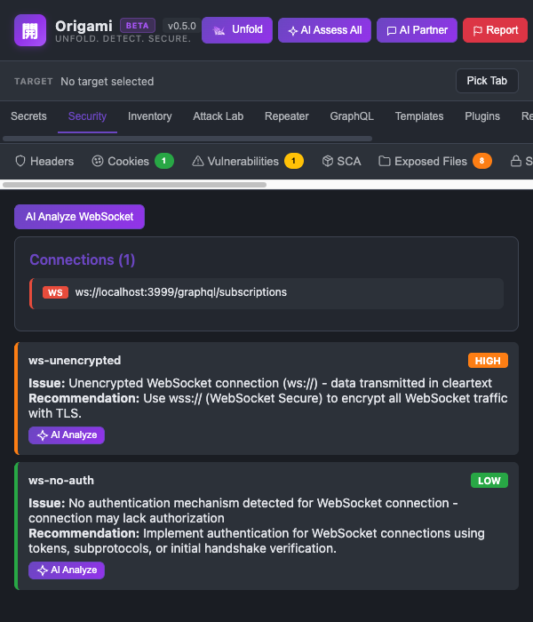


## HTTP Repeater

Craft HTTP requests, send them via the background service worker (bypassing CORS restrictions), and inspect responses.

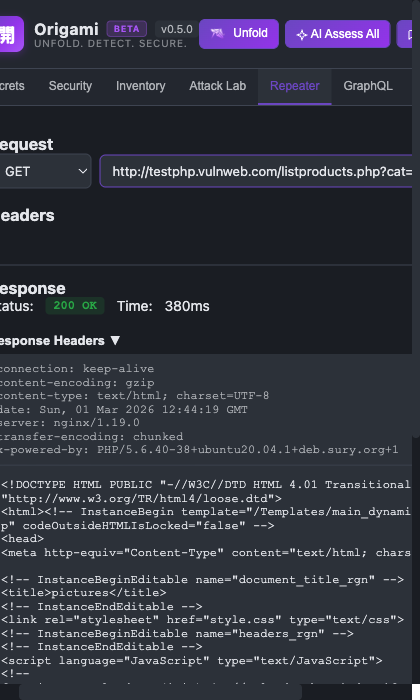

- Select HTTP method (GET, POST, PUT, DELETE, PATCH, OPTIONS, HEAD)
- Enter the target URL and add custom headers
- Add a request body for POST/PUT/PATCH requests
- View response status, headers, body with syntax highlighting, and timing
- **Import cURL** to load a request from a cURL command
- **Export cURL** to copy the current request as a cURL command
- Request history with replay capability


## GraphQL Mapper

Auto-detect GraphQL endpoints and map the attack surface.

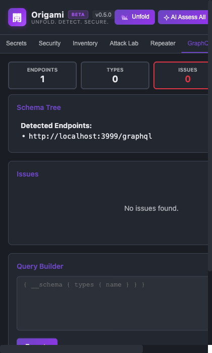

- Auto-detect GraphQL endpoints across Apollo, urql, Relay, and raw `/graphql` paths
- Introspection queries via the background service worker to bypass CORS restrictions
- Schema visualization with types, queries, mutations, and enums
- Security checks: auth gaps on mutations, deep nesting denial-of-service, sensitive field exposure, batching attacks, deprecated field usage
- Built-in query builder for crafting and testing queries


## Resource Inventory

The Inventory tab provides a comprehensive view of all page resources with four sub-tabs.

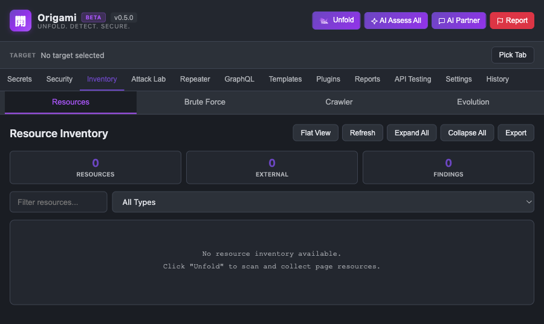

### Resources

Hierarchical tree view and sortable flat view of all page resources organized by path (scripts, stylesheets, images, fonts, iframes, technologies). External domains are automatically categorized with badges (CDN, Analytics, Ads, Payment, Fonts, Social, Auth, Maps, Monitoring).

- Toggle between **tree view** and **flat view**
- Filter by resource type (documents, scripts, stylesheets, images, API/fetch, links)
- Search by name or URL
- **Export** inventory as JSON for offline analysis
- Security finding correlation showing which resources have associated vulnerabilities

### Brute Force

Directory and file brute forcing with a curated wordlist of 500+ common paths.

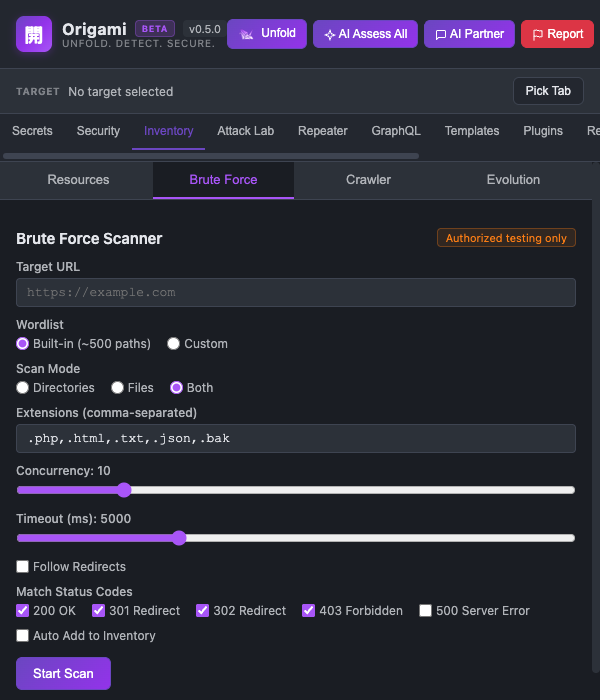

- Built-in wordlist covering admin directories, API endpoints, config files, backup files, hidden dotfiles, and sensitive resources
- Custom wordlist support (one path per line)
- Configurable scan mode (directories, files, or both)
- Adjustable concurrency, timeout, and file extensions
- Selectable status code matching (200, 301, 302, 403, 500)
- Option to auto-add discovered resources to the inventory

### Crawler

Web crawler for discovering linked pages and resources across the current domain.

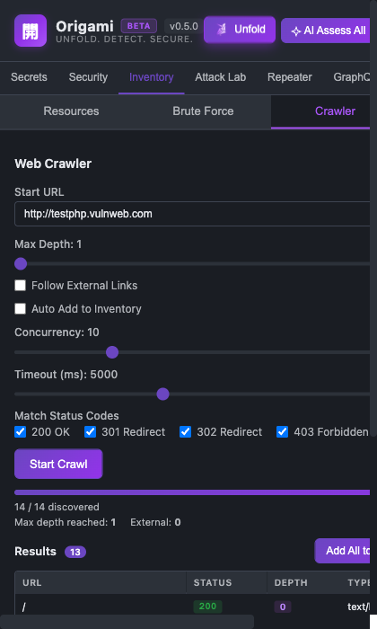

### Evolution

Attack surface evolution tracker. Save baselines of the current scan state per domain and compare them over time. Detects new or removed resources, technology changes, header changes, cookie changes, and finding count deltas. Stores up to 5 baselines per domain.

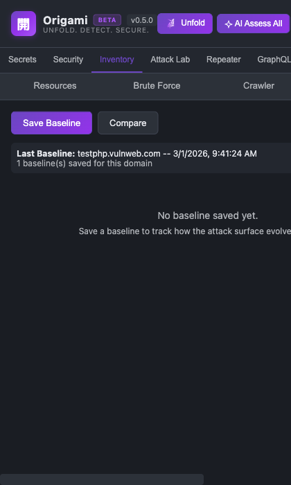


## API Key Testing

Validate discovered API keys against live services to determine their scope and permissions.

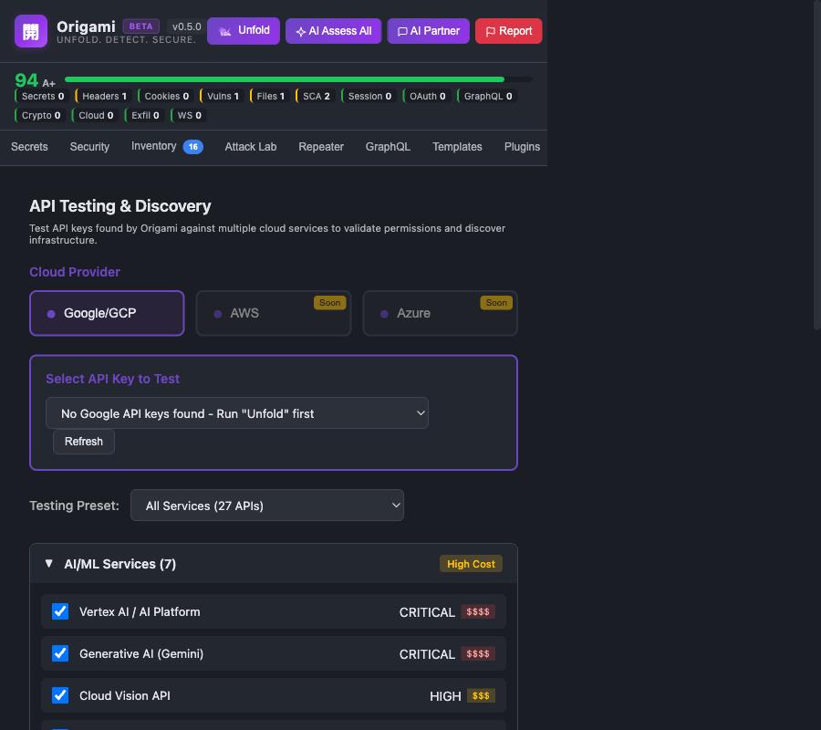

- **Google API Keys** -- Test against 27 Google services (YouTube, Maps, Drive, Sheets, Calendar, Gmail, Analytics, BigQuery, Vertex AI, Gemini, Vision, Speech, Cloud Storage, and more)
- **AWS Credentials** -- Validate AWS access keys
- **Azure Credentials** -- Test Azure connection strings
- Results show which services the key has access to and the permission level


## Detection Templates

Nuclei-inspired YAML template format for custom detection rules. Create, edit, import, export, and dry-run templates against the current page.

- 5 built-in templates (JWT in URL, debug endpoints, API key exposure, open redirect parameters, sensitive comments)
- Regex matchers targeting URL, response body, inline scripts, headers, cookies, and storage
- AND/OR matcher conditions
- ReDoS-safe regex enforcement with pattern length limits and execution timeouts
- **AI Auto-Rule Generator** -- Generate YAML templates from natural language input, CVE IDs, or vulnerability descriptions
- Import and export templates for sharing


## Plugins

Load custom analyzer plugins via JSON manifest and JavaScript analyzer code. Plugins run within the content script pipeline alongside built-in analyzers.

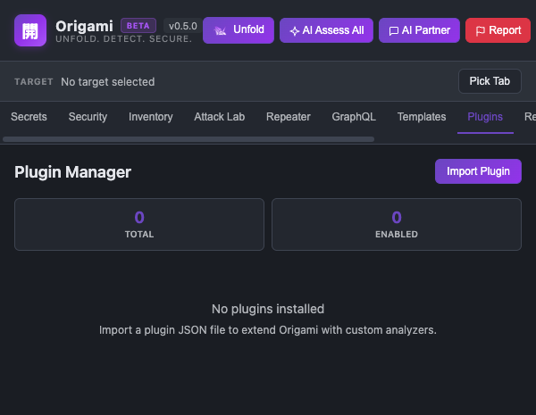

- Import plugins from JSON manifest + JavaScript files
- Enable, disable, and remove plugins
- Plugin results merge into the unified findings pipeline
- See [PLUGINS.md](PLUGINS.md) for the complete plugin development guide


## Reports

Generate comprehensive security reports from the current scan results.

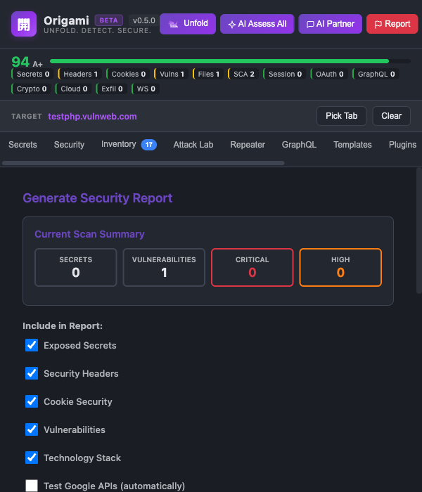

- **HTML** -- Professional formatted report with styled sections
- **Markdown** -- Portable text format for documentation
- **JSON** -- Machine-readable format for integration with other tools
- AI-enhanced executive summaries and remediation plans (requires LLM configuration)
- One-click copy to clipboard
- Webhook integration for CI/CD pipelines (POST/PUT/PATCH)


## Scan History

Review past scan results across sessions.

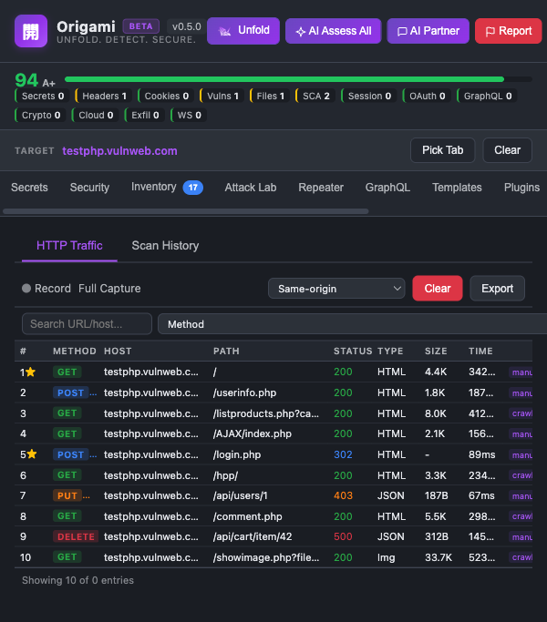

- Stores up to 100 scan entries
- Each entry shows the scanned URL, timestamp, finding counts by severity, and overall score
- Click any entry to review its findings in detail
- Clear individual entries or the entire history


## Settings

Configure all aspects of Origami's behavior. Settings are organized into collapsible sections that expand on click.


- **Notifications** -- Configure browser notification preferences for different severity levels
- **Webhook Integration** -- Set up webhook URL, HTTP method (POST/PUT/PATCH), and custom parameters for sending findings to external services. Payload format:

```json
{
  "timestamp": "2026-02-18T10:30:00.000Z",
  "url": "https://example.com/page",
  "domain": "example.com",
  "findings": [
    {
      "key": "test-key-12345...",
      "risk": "HIGH",
      "pattern_matched": "AWS Access Key",
      "length": 20
    }
  ],
  "summary": { "total": 5, "high": 3, "medium": 2 }
}
```
- **Whitelist** -- Add domains to skip scanning entirely and patterns to ignore known false positives
- **Secret Detection Patterns** -- View built-in patterns and add custom regex patterns with configurable risk levels
- **Vulnerability Scanning** -- Toggle specific vulnerability detection modules
- **CVE and End-of-Life Checking** -- Configure CVE data sources and EOL checking
- **Analyzer Modules** -- Enable or disable individual analyzer stages
- **LLM Prompt Templates** -- Manage the 15 pre-built security analysis prompts
- **LLM Integration** -- Select provider (OpenAI, Anthropic, Gemini, Ollama), enter API key, choose model, and adjust parameters
- **AI Assessment Configuration** -- Configure which finding types and severity levels the "AI Assess All" button analyzes
- **Security Score Configuration** -- Adjust scoring weights and category caps
- **History** -- Configure scan history retention
- **MCP Bridge (Claude Code)** -- Enable WebSocket bridge for Claude Code integration
